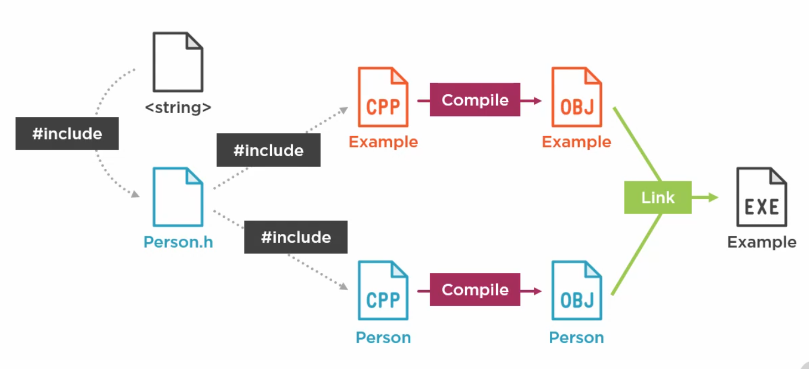

= Notes

== Overview

{cpp} is a powerful language that's suitable for platforms as small as embedded systems, and as large as servers and clusters.
It delivers tremendous performance, not just fast code, but code that uses less electricity to get the job done.

== Understanding {cpp} in context

Modern {cpp} is way different from older {cpp}.

* Memory management need not be manual
* No need for manual pointer arithmetic
* Looks a lot more like C# or Java but faster

{cpp} doesn't belong to a person or a company.
The https://isocpp.org[standards committee] defines the language and compiler vendors implement their compiler as per this standard.
[IMPORTANT]
====
Backward compatibility is maintained between all versions of the language.
Hence, no need to worry about code compilation when moving to a new version of the language.
====
Different vendors reach 100% compliance at different pace.
The big 3 compilers are GCC, clang, MSVC.
Generally, you don't have to worry about this as most compilers will eventually reach there.
But, it is good to know that this exists.

The https://en.cppreference.com/w/[wiki for {cpp}] lists everything related to the language.

Standard library has a lot of useful classes, collections, smart pointer, and stream IOs etc.

You can find a compiler https://isocpp.org/get-started[here].

== Tools
{cpp} is a general purpose language which can be used to build a variety of applications:

* Embedded and Mobile devices
* Console apps
* Services
* Server apps
* Client apps
* Libraries for all the above

== Variables and Fundamental Types

{cpp} is a strongly-typed language

* Variables can hold only certain types of values
* Variables need to be declared before they are used
* Post declaration variable type cannot be changed

There are fundamental built-in types in the language:

* Numbers
** Integers
+
All integer datatype corresponds to the number of bytes that it can hold.

*** `char`: 1 byte
*** `short`: 2 byte
*** `int`: holds the size of the address bus of the device
+
most efficient type and not standardized for historic reasons
*** `long`: 8 byte
*** `long long`: 16 bytes

+
+
Here the range of numbers that can be held by the integer depends on whether it is signed or unsigned.

*** `signed`: Range: -2^n-1^ to 2^n-1^-1
+
By default, integer type is considered signed.
*** `unsigned`: Range: 0 to 2^n^-1
+
To use unsigned integer type it needs to be explicitly specified using this keyword
** Real numbers
*** float
*** double
* Boolean
** bool
* Single characters
*** When an utf-8 character is enclosed in single quotes, compiler translates the character into its ascii value which is an unsigned 1 byte number which can be stored into `char` type

User defined types using structs and classes.
[NOTE]
====
They are full participants, they can do everything that a fundamental type can do.
====

Sometimes typing the type can be annoying, difficult or even impossible.
Hence, {cpp} has `auto` keyword which forces the compiler to deduce the type for us.
[NOTE]
====
Even if you `auto`, variable is still strongly typed.
====
[TIP]
====
Use it to enhance code readability, for example, in case of ugly iterator declarations, or difficult to figure out lambda types.
====

=== Casting
When we mix types that are incompatible with each other, we might suffer from loss of precision etc.
Hence, we get a compiler warning.
If this is intentionally done, then to tell the compiler to not worry, you can do casting.
[WARNING]
====
Don't simply cast to suppress compiler warnings.
Make sure that you clearly understand what you are doing.
====

Unlike C which uses unsafe round bracketed casts, {cpp} has safe casts(also called as templated casts), always use them.

== User defined types
=== `class`

A `class` can depict the properties and the behavior.
Properties are the data members, and behavior is implemented by the function members.
These members maybe `private`, `protected`, and `public` which determines their visibility to code outside the class.

Unless specified, by default the members are private.

`private` makes sure that code within the class or the friend of the class can access a member.
[WARNING]
====
Data encapsulation is an important virtue.
Hence, you should not make all public.
Make everything private and write a public getter to provide access to required private members.
Using friend function should be your last choice.
Use it if and only if you think adding a public getter is going to violate the encapsulation by unnecessarily exposing something that is required by only one class to everyone else.
====
`public` allows code both inside and outside the class to access a member.
`protected` is like `private` for everyone except the class that inherits the class under consideration.

An object is an instance of a class which is declared like a variable of a fundamental type.

==== Constructor
An object's properties can be initialized using a special function called constructor which has the same name as the class and is executed right after the object creation & before any other code is executed.

The compiler inserts a default constructor that initializes the data members.
The default constructor takes no arguments and hence if the data members are fundamental types they can be filled with junk, and if they are user-defined types such as other class they can call their respective constructor.

You can add your own constructor to initialize the members.
When you add your own constructor, the compiler stops generating the default constructor.
Hence, if you would still like to have a default constructor, you will need to explicitly write one.

Just like any other member functions constructors will also have an access specifier.
Based on how you want to use a particular class, you can determine where to put the constructor.

==== Scope
Variables have a lifetime.
When an object is declared, the constructor is called and the memory is allocated for it.
At the end of the closing brace of the function body that it was created in, its destructor is automatically called, and after destructor runs, the next step is to free the memory used by the object.
Writing a destructor is optional.

[TIP]
====
Resource acquisition is done in constructor, and release is done in destructor.
This way you can never forget to release a particular resource when the object using it no longer exists.
====

==== Building

You'll need to declare a class/function in the header and include it in the source file where you implement or instantiate/call it.
Keep a class's implementation in a single source file.

[TIP]
====
You may get a ton of error messages from an error at single or multiple place(s) in code.
Always focus on the first error message and try resolving it first.
In other words, go chronologically.
====

Build errors are of 2 types:

* Compiler error:
** When a function is called and there is no promise of that function in a project header file
** When the relevant header that contains the promise is not included in the source file
** the path variable of the build system doesn't contain the proper path where the header is located
** the function's invocation signature(types of return/argument and number of arguments) is different from the signature in the header
* Linker error:
+
[NOTE]
====
You may not get a linker error though you have violated the promise you made.
This happens when there is a compilation error in the file.
There is no linking happening when one of the file itself is not compiled.
====

** When a promise of function is made in a header file but the promise is not kept in other words the function is not implemented anywhere in the project source files
** When you forgot to include the proper source file into the project

In summary, if you forget to make the promise(link) you get compile error, and if you forgot to keep the promise(compile) you get linker error.

=== `struct`
This is same as `class` but here, by default, members are `public` unless specified otherwise.
Conventionally, they are used only to hold data, and as soon as any behavior comes to picture i.e. method, then it is converted into a `class`.

=== `namespace`
They are used to prevent the name collisions between members of classes.
It separates from class name with `::`.

[WARNING]
====
Never write `using` constructs in a header file.
People using your header files, may not want to get your `using` statements
====

=== inheritance

Inheritance is when you derive a new class from another class.
This enables code reuse.

The access specifier of the base class members within the inherited class depends upon the type of inheritance and the visibility of the base class members in their base class.

`private` members are anyway not visible to any code outside the class.
Hence, the inherited class can't see or access the `private` members of the base class.

|====
|Type of Inheritance |Base class access specifier |Access in derived class

.2+|public

|protected
|protected

|public
|public

.2+|protected

|protected
|protected

|public
|protected

.2+|private

|protected
|private

|private
|private

|====

=== `enum`
It is a construct used to associate unique names to a set of constants.
Easy to forget constants, so better to use names under an enumeration.

In {cpp}, even `enum` can be scoped under a class/struct or created as its own `enum class`.
Due to scoping, enums can have a same name associated with their constants.
Hence, you'll need to use fully-qualified names to use them.

In {cpp}, the underlying type of the constants in an enum can be a type other integral type other than `int`.

[TIP]
====
Use scoped enum over C style unscoped enum.
====

=== Preprocessor directives
These are instructions for the preprocessor.
They start with `#`

[WARNING]
====
When used incorrectly, can lead to subtle bugs.
Hence, you need to be very careful when using them.
====

In modern {cpp}, the only thing you'll probably ever need is `#include`.

== Flow control

These statements allow you to control the flow of the program.
Hence, you can perform decision-making and looping.

If there is only one statement under the condition for flow control, then braces can be omitted.
[IMPORTANT]
====
For the sake of readability, use braces.
====

=== Decision-making

`if`(`-else`), `switch`, `goto`, immediate if using ternary operator.

[WARNING]
====
Do not use `goto` it will affect readability and maintainability of your code.
====

Use ternary operator if and only if the code is very short, and you can fit in a single line.

==== `switch`
It is a good alternative when you are testing a variable against too many values of integral type or an `enum`(which is in an integer behind the scenes).
`break` is used to prevent fall through.
`default` is used run some code when no conditions are met.

In C++17, you can do:
----
switch(int x = someFunc(); x)
----
this will make sure that `x` goes out of scope when program comes out of the `switch` statement.

=== Looping

`while`, `do-while`, `for`.

`break` and `continue` can be used to exit the current loop or skip the current iteration.

`while` and `for` are a pre-check loops and `do-while` is a post check loop.

`while` to do something as long as a condition is true.
`do-while` do something once and then same as `while`
`for` to do something for a certain number of iterations.

== Functions

Functions don't have to be a part of class.
They can be free functions.

Normally, functions are written in source file.
But, if they are small enough(like one-line functions), then can be written in headers as `inline` functions.
For class members you may omit the `inline` keyword.
Inline functions are not compiled as a jump instruction, rather they are simply copied as another line of code at the place where they are called.
Avoiding a jump via an inline function will save both time and data memory.
[NOTE]
====
If you enable compiler optimization, you don't have to think about all this, modern compiler will auto inline functions wherever appropriate.
====

[IMPORTANT]
====
Member functions should be marked as `const` unless you want to allow the member function to change the member variable.
====

=== Parameters, and Return

When you pass a parameter to a function or return from a function you can do it by:

* value:
+
For passing the parameter, a copy of the parameter is made, and the function acts on the instance of the copy.
Hence, any changes are made on the copy, leaving original instance, unaffected.
+
For returning the value, a copy of the value is made, hence it is always safe.
* reference:
+
When parameter is passed by reference, function acts on the original instance of the parameter.
Hence, any changes made inside the function changes the original instance.
This is also used when passing objects as it prevents copy which incurs a runtime cost both in terms of speed and memory.
+
If you want to use reference only to make sure that there is no copy but at the sametime you want to be sure that the original data is not changed, then you can use `const` on the reference type to prevent modifying it.
+
[WARNING]
====
Returning a value's reference is an advanced technique.
Unless you understand scope, lifetime very well, you shouldn't be doing that.
====

== Operators

=== Arithmetic

* Unary: increment(`++`), and decrement(`--`).
They can be used to increment/decrement a value pre- or post-execution of a statement where they are used.
+
[TIP]
====
To enhance code readability don't hesitate to skip this and use a binary operator
====

* Binary:
+
[WARNING]
====
If you do something illegal like division by zero while using division or modulo operator, then the code will crash.
Hence, always do a check to ensure that denominator is non-zero when doing division.
====
** Arithmetic: `{plus}`, `-`, `*`, `/`, and `%`
+
[NOTE]
====
There is no operator for exponent.
All operators have a precedence between them.
All meaning punctuations are already used for operators and also there is no piece of punctuation available to be the exponent operator that would have the right operator precedence.
====
** Shortcut: `{plus}=` `-=`, `*=`, `/=`

=== Comparisons

`<`, `\<=`, `>`, `>=`, `==`, and `!=`

[WARNING]
====
`=` is an assignment operator not an operator to check equality.
It returns the value that was assigned.
Hence, if you use it instead of `==`, your condition checking will be flawed.
For example:

----
if(a=0)
----
will always be false as `=` in above statement assigns `0` to `a` and returns `0` which is interpreted as false.

----
if(a=3)
----
will always be true as `=` in above statement assigns `3` to `a` and returns `3` which is a non-zero value which will be interpreted as true.
====

[TIP]
====
You can avoid the error of using `=` for comparison by:

* writing all your equality checks backwards:
+
----
if(3==i)
----
+
in this case if you forget to put one of the `=` in `==`:
+
----
if(3=i)
----
+
you'll get compiler error

* change your compiler warning to a higher level to get a warning message when you have code like
+
----
if(i=3)
----

====

=== Boolean

* Compound decision-making
** `&&`: if the first condition is false then conditions that follow are never executed
** `||`: if the first condition is true then conditions that follow are never executed

[WARNING]
====
If you have code that has side effects(meaning something that changes the behavior) inside the condition check.
Then be careful coz they may or may not run due to shorting like described above.
====

* `!`: to reverse a true or false condition.

=== Bitwise

* logical: `&`, `|`, `^`, `~`
+
[WARNING]
====
Be careful coz if you do:

----
b = 4|1;
----
now `b` is 5

----
b = 4||1;
----
now `b` = 1
====

* shift:
+
[NOTE]
====
When performing multiplication/division with 2, shift operators can be way faster than arithmetic operators.
But, don't use them in place of arithmetic operator for code readability.
Your compiler will do such optimization.
====

** `<<`: val1 << val2 => val1 * 2^val1^
** `>>`: val1 >> val2 => val1 / 2^val1^

=== Operator overloading
It is at the heart of generic coding in {cpp}.
It works for user-defined types just like it would work for fundamental types.
For example, instead of writing a function member in a class that compares if two instances are equal or not, you can overload the `==` operator, and use it for such a comparison.

To load an operator, you just need to write a function with a special syntax.
This function may or may not be a free function.
The overloaded operator can act on same data type or different ones.

[NOTE]
====
Any operator can be overloaded.
But use the one which conceptually represents the operation that you want to do.
====

== Templates
Templates are similar to generics in C but differs in some important ways.
It allows you to apply the same logic/operation on elements of different datatype.
In {cpp} they are resolved at compile time and no runtime checks, which causes longer compile time but provides better run-time performance.
They often rely on operator overloads.

[NOTE]
====
Much of the STL(standard template library) is template-based as the name suggests
====
