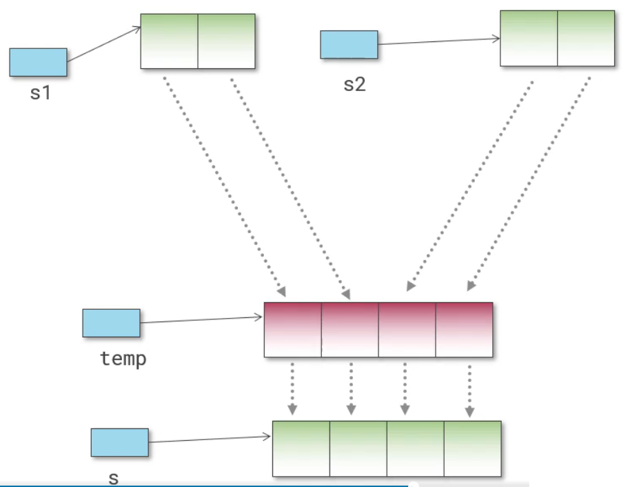
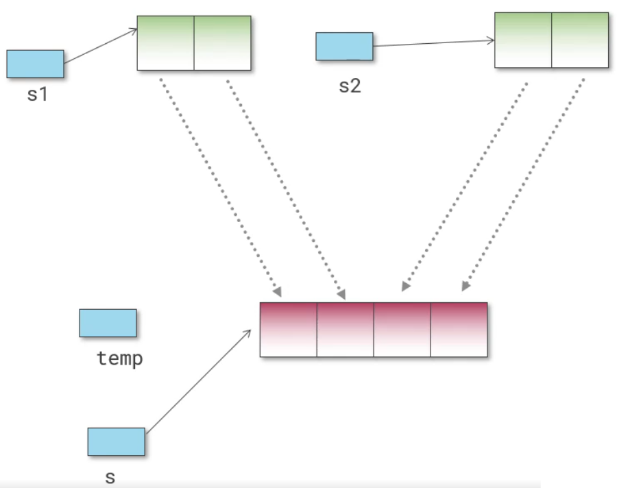

== Move semantics

Introduced in C++11.

When you have objects which have a pointer to data somewhere else, and you want to copy, you can shallow copy or deep copy.
Shallow copy is risky as it causes a potential to have dangling pointers and deep copy is expensive.
If in case, you don't need the original anymore but want to have only the copy, then instead of creating a copy and destroying the original one, you can "move" the original one.

.Adding two strings(copy)

Here strings `s1` and `s2` are added in to get `temp` and then `temp` is copied to `s`

.Adding two strings(move)

Here strings `s1` and `s2` are added in to get `temp` and then `temp` is moved to `s`.
Now `temp` is no longer usable and `s` will be the variable bound that address.
[IMPORTANT]
====
Not usable doesn't mean variable is bound to a dangling pointer, it means that variable loses ownership.
Hence, when it goes out of scope nothing happens.
Even better, if you use it again after moving, the code itself will not compile!
====

=== Rvalue references

Those expressions that cannot be on the left-hand side of an assignment operator is called Rvalue.
A Rvalue is temporary in contrast to a Lvalue.
Lvalue is something on the left side of the assignment operator whose address you can take.

Rvalues are temporary, hence you can move them.

If you have two overloads of a function with a parameter that takes:

* Ordinary reference: `&`
* Rvalue reference: `&&`

If you call something that will go away, the compiler will automatically pick the function with Rvalue reference.

For constructor and assignment operator, we have two overloads:

* Copy
* Move
+
Just like copy constructor and assignment, you'll need to initialize the member variables of the class using the value that's been passed in.
But, way faster than copy.
+
In case of move assignment operator you'll need to do something about values that are already there.

[WARNING]
====
You should leave the passed reference in a valid state.
It can be empty, meaning it shouldn't still be pointing to some memory that you don't want to clean up by it.
====

For `std::string` and `std::move`, moving is implemented in STL.
If your type is movable, vector resizing etc. will be faster.

To have a movable type:
----
Obj(Obj&& o):var(std::move(o.var)){}

Obj& operator=(Obj&& o){
    if(this != &r){ // to avoid self assignment
        var = std::move(o.var);
        o.var.clear();
    }
    return *this;
}
----

don't use anything to delete constructors.

A function can take a parameter many ways:

* by value: do a copy
+
----
func(T x)
----
+
Value can be `const`.

* by pointer: use the address to manipulate an object elsewhere without doing any copy
+
----
func(T *x)
----
+
Pointer or target or both can be `const`.

* by reference: use the reference to manipulate an object elsewhere as if it was here in local scope without doing any copy
+
----
func(T &x)
----
+
A reference can be a `const`

* by move: move the ownership of a resource from one variable to another
+
----
func(T &&x)
----
+
Here you cannot use `const` coz you are moving

If you are writing a move constructor or a move assignment operator,

=== Writing code in a post-move world

* Passing by value is dangerous and/or the copy can be very expensive
+
No, if it is a temporary that is passed by value to a function, then compiler will automatically choose to move it rather than copy it, if the type is movable

* Returning the local variable by value will cause a copy
+
No, compiler will just move it

* vector resizing is slow
+
No, it really depends on if the type that it is working with is movable or not.

* Building strings from tiny pieces is inefficient
+
Now, instead of doing copy on every `+` operation, the results are moved

=== `std::move`
`std::move` is a cast that turns a LValue into a RValue reference.
When it does that, the compiler upon encountering a constructor or an assignment operator will choose the move version rather than copy one.

Hence, itself doesn't move, it causes the compiler to choose the right version.

[TIP]
====
When you want to put a pointer to a resource into a collection.
Create a `unique_ptr` from the pointer, and use `std::move` to move it in & out of the collection.
====

=== Rules

==== Rule of three
If you write a destructor, copy constructor, or an assignment operator, write all three.
For example, lets say you just write a destructor, then without a copy constructor, all copies will be a shallow copy.
Hence, when one of the variable goes out of scope, the destructor gets called, and the remaining one will be dangling.

==== Rule of five
Rules of three is good for manual memory management, but in a post-move world, you can gain better performance by rule of five.
Add a move constructor and move assignment operator to the rule of three.
In summary, just write all five unless you want to follow rule of zero.

==== Rule of zero
Use member variables that manage themselves for example stl containers, and smart pointers etc.
Then you'll not have to write destructor and hence, you don't have to write copy and move constructors and assignment operators.

